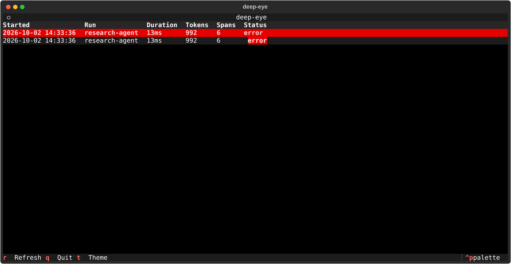
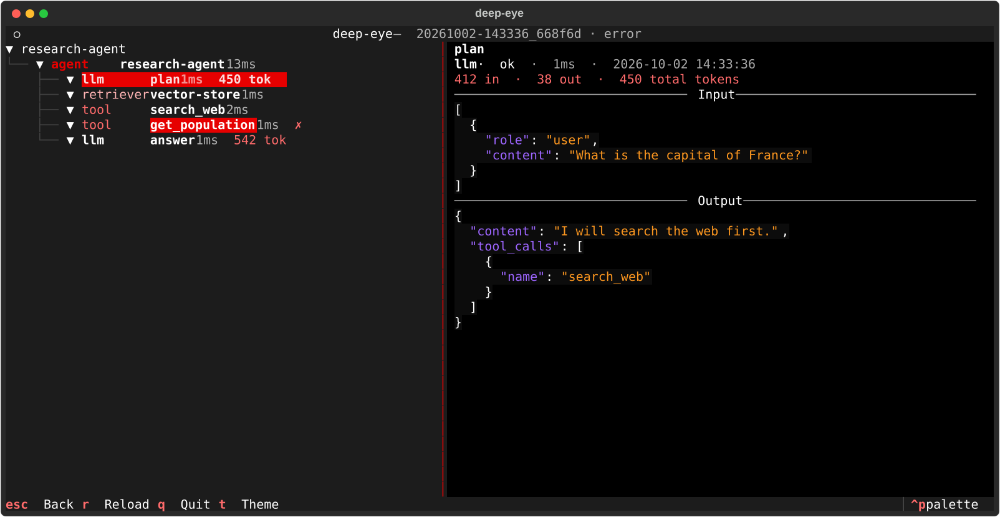

# deep-eye

deep-eye records what your LLM agent does. It writes the records to local
files, and it shows them in a terminal viewer. It does not use a server,
Docker or an account.

```
your code  ──►  .deep-eye/*.jsonl  ──►  deep-eye   (terminal viewer)
```





> **NOTE:** I made deep-eye to find problems in the agents that I make at
> work. It supports my workflow: Python agents in one process, on my own
> computer. deep-eye is an early version (v0.1). It is not on PyPI. Read the
> [Limitations](docs/reference.md#limitations) before you use it.

## Install

You must have Python 3.10 or a later version. deep-eye is not on PyPI.

1. Install deep-eye from GitHub:

   ```bash
   pip install "git+https://github.com/AbdoAlshoki2/deep-eye.git"
   ```

2. If you use a framework, install its extra. The extras are `langchain`,
   `openai-agents` and `otel`:

   ```bash
   pip install "deep-eye[langchain] @ git+https://github.com/AbdoAlshoki2/deep-eye.git"
   ```

To install from a local copy:

```bash
git clone https://github.com/AbdoAlshoki2/deep-eye.git
cd deep-eye
pip install -e ".[langchain]"
```

## Quick start

### 1. Trace your code

```python
from deep_eye import trace, span

@trace(kind="tool")
def search(query: str) -> str:
    ...

@trace(name="my-agent", kind="agent")
def run_agent(question: str):
    with span("plan", kind="llm", input=question) as s:
        s.output = "..."
        s.usage = {"input_tokens": 120, "output_tokens": 40}  # optional
    return search(question)

run_agent("What is deep-eye?")
```

deep-eye writes one file for each run to `./.deep-eye/`. Add `.deep-eye/` to
your `.gitignore` file.

### 2. Or use a framework

| Framework | Install | Connect |
|---|---|---|
| LangChain, LangGraph | `deep-eye[langchain]` | `agent.invoke(inputs, config={"callbacks": [DeepEyeHandler()]})` |
| OpenAI Agents SDK | `deep-eye[openai-agents]` | `install()` one time, then run your agents |
| OpenTelemetry (LlamaIndex, CrewAI, DSPy and others) | `deep-eye[otel]` | `install()` one time at startup |

For example, with LangChain:

```python
from deep_eye.integrations.langchain import DeepEyeHandler

agent.invoke(inputs, config={"callbacks": [DeepEyeHandler()]})
```

For the OpenAI Agents SDK and for OpenTelemetry, the import is
`from deep_eye.integrations.openai_agents import install` or
`from deep_eye.integrations.otel import install`.

The full list of frameworks, tested versions and other ways to connect is in
[the reference](docs/reference.md#frameworks-that-you-can-use-with-deep-eye).

### 3. Look at the traces

```bash
deep-eye                        # interactive viewer
deep-eye list                   # table of runs
deep-eye show latest            # one run as a tree
deep-eye export -o spans.jsonl  # one JSON record per span
```

In the viewer, press `Enter` to open a run, `Esc` to go back, `/` to filter,
`t` to change the theme and `q` to quit.

## Usual tasks

| Task | How |
|---|---|
| Put traces in a different folder | Set `DEEP_EYE_DIR`, or call `deep_eye.configure(trace_dir="traces")`. |
| Stop tracing | Set `DEEP_EYE_ENABLED=0`. |
| Record only some runs | Set `DEEP_EYE_SAMPLE_RATE=0.1` (1 run in 10). |
| Keep the data of a function out of the trace | `@trace(capture_input=False, capture_output=False)` |
| Trace work in a thread | Use `propagate(fn)` before you send `fn` to the thread. |
| Trace callbacks (start and end in different places) | Use `start_span()` and `end_span()`. |
| Delete old traces | `deep-eye clear --older-than 7` |

deep-eye hides usual secrets (API keys, passwords, authorization headers)
before it writes to the disk. This is not complete protection. Traces are
plain, unencrypted files, so do not trace production traffic that has
sensitive data. Refer to [Security](docs/reference.md#security).

## More information

The [reference](docs/reference.md) has the full technical information:

- [Ways to connect deep-eye to your code](docs/reference.md#ways-to-connect-deep-eye-to-your-code)
- [Frameworks and tested versions](docs/reference.md#frameworks-that-you-can-use-with-deep-eye)
- [All settings, redaction and sampling](docs/reference.md#settings)
- [Framework adapters](docs/reference.md#framework-adapters) and how to [write an adapter](docs/reference.md#write-an-adapter)
- [The viewer and the CLI](docs/reference.md#see-the-traces)
- [Export and the trace file format](docs/reference.md#trace-files)
- [Security](docs/reference.md#security)
- [Limitations](docs/reference.md#limitations)
- [Development](docs/reference.md#development)

`examples/langgraph_agent.py` is a full LangGraph example. It uses Gemini. To
run it, do `pip install -e ".[examples]"` and put a Google API key in `.env`.
